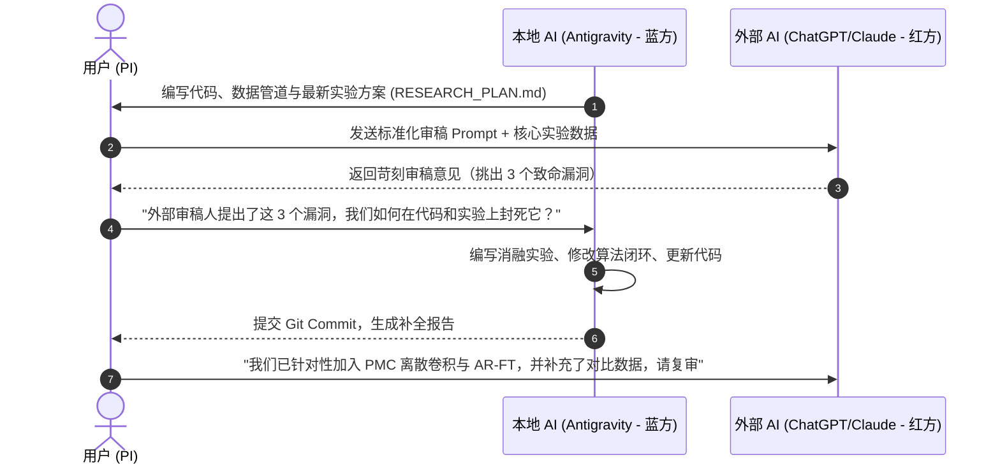

# 双 AI 协同与交叉审核工作手册 (Dual-AI Research Collaboration Protocol)

> **目标**：通过本地编程 AI（Antigravity）与外部对话 AI（如 ChatGPT-4o / Claude-3.5 / o3 网页端）的角色不对称分工，实现 **1 + 1 > 2** 的学术生产力，杜绝“互相吹捧（AI Sycophancy）”与“无效车轱辘话”。

---

## 一、 为什么很多“双 AI 协作”会失败？

1. **同质化迎合（Sycophancy Trap）**：AI 默认倾向于认同人类或其他 AI 的观点。如果你把方案丢给另一个 AI，它大概率会回复：“这个 idea 太棒了！非常具有创新性！”，从而掩盖致命漏洞。
2. **上下文污染（Context Pollution）**：把大段无结构聊天记录在两个窗口拷来拷去，AI 会迅速迷失在口水话中，产生幻觉。
3. **无真实执行反馈（No Grounding）**：两个 AI 悬空讨论概念，没有任何代码执行和实测数据，最终沦为空中楼阁。

---

## 二、 黄金分工法则：角色不对称机制（Role Asymmetry）

| 角色 | 担当者 | 职责 | 工具与权限 |
|---|---|---|---|
| **蓝方：主工程师兼执行者 (Lead Builder & Coder)** | **Antigravity (当前本地 AI)** | 负责数据生成、算法实现、Kaggle 脚本调试、数学严谨性闭环、Git 版本控制与实验日志管理。 | 本地终端、文件读写、真实运行与语法检查。 |
| **红方：敌意审稿人兼理论顾问 (Hostile Reviewer & Area Chair)** | **外部 AI (网页端 ChatGPT / Claude / o3)** | 负责死抠漏洞、理论溯源、期刊匹配、以最苛刻的角度找出 Desk Reject 的理由。 | 广谱文献检索、高阶论文行文风格、逻辑辩驳。 |
| **项目总监 (Principal Investigator, PI)** | **你 (Human User)** | 仲裁决策、在两个 AI 之间传递标准化中转卡片，把控论文真实投递节奏。 | 最终决定权。 |

---

## 三、 单一事实源规范（Single Source of Truth, SSOT）

两个 AI **严禁直接传递冗长的日常聊天记录**！一切交流必须围绕 Git 仓库中的三个核心文件：

1. `RESEARCH_PLAN.md`：核心研究方案（包含形式化定义、C1/C2/C3 创新点、预注册指标）。
2. `gen/` & `kaggle/`：可执行的代码与运行脚本。
3. `data/`：真实运行结果与统计数据。

---

## 四、 即插即用的“红方审稿 AI”Prompt 模板

当你把方案拿去给另一个 AI 审阅时，**绝对不要问“你看这个 idea 怎么样”**。请直接复制以下 Prompt：

```markdown
【身份设定】
你是计算机顶刊/中科院 2-3 区期刊（如 Applied Intelligence, Cognitive Computation）的资深副主编（Associate Editor）和极其苛刻的审稿人（Reviewer 2）。你的审稿风格是以挑刺、找致命逻辑漏洞、质疑实验内部/外部效度著称，绝不进行无意义的客套与吹捧。

【背景材料】
我们正在进行一项关于 System 1 判断模型（Jev/Kev）多跳组合推理能力边界与神经-符号分解的研究。
仓库方案与当前核心进展如下：
1. 理论框架：构建 System 1（单步直答）vs System 1.5（概率模块化组合 PMC）vs System 2（LLM-CoT）的三方 Pareto 对比。
2. 实证发现（C1）：微调虽在 k<=2 达到 99%，但 k=3 遭遇断崖崩塌（23%）。
3. 方法创新（C2）：提出概率模块化组合（PMC），采用离散二维空间卷积进行不确定性传播，避免外部纯代码加法的“伪分解”质疑。
4. 校准修复（C3）：发现微调导致歧义 ECE 恶化（0.15 -> 0.42），提出歧义正则化微调（AR-FT），通过混入平衡歧义锚点挽救校准。

【你的任务】
请不要泛泛夸奖，直接给出你的《审稿意见书》（Peer Review Report），重点直击以下 4 点：
1. 【致命伤排查】：这篇文章如果投递 Applied Intelligence，有哪些最可能导致拒稿（Desk Reject）的硬伤？
2. 【理论与基线漏洞】：与现有 Compositional-ARC、LLM Cascades、StepGame 相比，理论差异是否被高估？还缺少哪些必须对比的 Baseline？
3. 【方法有效性挑刺】：PMC（离散卷积组合）和 AR-FT 在审稿人眼中是否会被攻击为“过拟合特定人造数据”？如何进一步提升其理论自洽性？
4. 【立即可执行的修改建议】：列出 3 条最具杀伤力的实验或消融补全建议。
```

---

## 五、 协同推进节奏表（推进周期）



按照此闭环迭代 2–3 轮，整篇论文的逻辑、代码与数据将达到牢不可破的严谨程度，投稿后即使面对严苛审稿人也能轻松过关！
